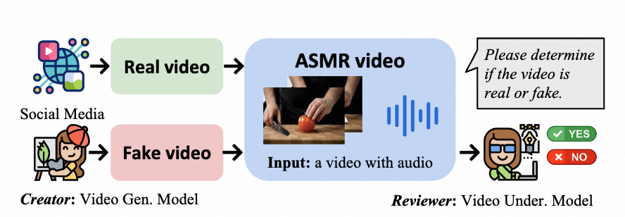
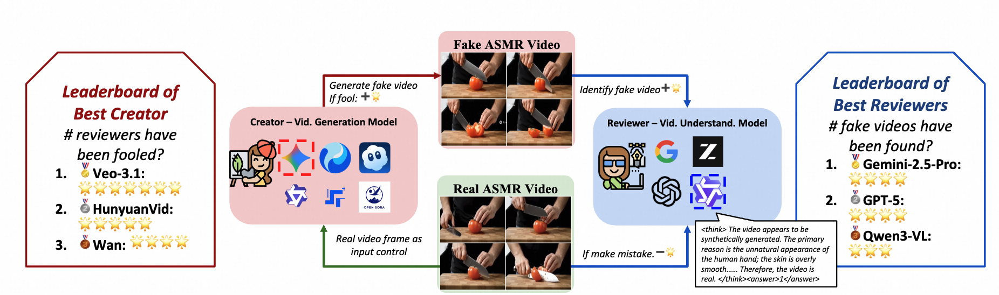
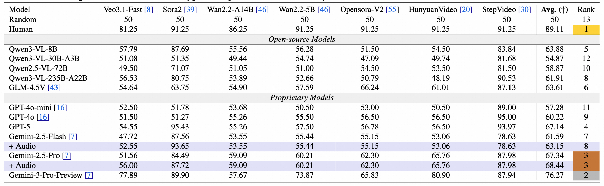

<p align="center">
<h1 align="center"> Video Reality Test: Can AI-Generated ASMR Videos fool VLMs and Humans?</h1>
</p>


<p align="center">
  <a href="https://arxiv.org/abs/2512.13281" target="_blank"></a>
  <a href="https://video-reality-test.github.io/" target="_blank"></a>
  <a href="https://huggingface.co/datasets/kolerk/Video_Reality_Test" target="_blank"></a>
  <a href="https://modelscope.cn/datasets/wjqkoko/Video_Reality_Test" target="_blank"></a>
</p>

<p align="center">

</p>

#  Updates

- 2025-12-15: Our paper is available on [arxiv](https://arxiv.org/abs/2512.13281).
- 2025-12-15: We update the data source.
- 2025-12-15: We release the video reality test repo.

##  1. Brief Introduction
We introduce Video Reality Test, an ASMR-sourced video benchmark suite for testing perceptual realism under tight audio–visual coupling, featuring the following dimensions: 

(i) Immersive ASMR video-audio sources. Built on carefully curated real ASMR videos, the benchmark targets fine-grained action–object interactions with diversity across objects, actions, and backgrounds. 

(ii) Peer-Review evaluation. An adversarial creator–reviewer protocol where video generation models act as creators aiming to fool reviewers, while VLMs serve as reviewers seeking to identify fakeness.



##  2. Todo List
- [x] Public paper
- [x] Public real ASMR dataset (hard+easy)
- [ ] Public AI-generated ASMR dataset (easy)
- [x] Public AI-generated ASMR dataset (hard)
- [x] Public video understanding evaluation code
- [x] Publish video generation code

##  3. Dataset Introduction

1. We release the real ASMR corpus with a total of 149 (100 hard level + 49 easy):
   - real videos (`Real_ASMR/videos`),
   - extracted images (`Real_ASMR/pictures`),
   - and prompts for hard level (`Real_ASMR_Prompt.csv`: `ref` is the image path, `text` is the prompt).
2. We release the AI-generated hard level ASMR videos from 13 different video-generation settings with a total of 100 x 13:
   - OpenSoraV2 (i2v, t2v, it2v),
   - Wan2.2 (A14B-i2v, A14B-t2v, 5B-it2v),
   - Sora2 variants (i2v, t2v) (w/o, w/ watermark),
   - Veo3.1-fast (i2v),
   - Diffsynth-Studio Hunyuan (i2v, t2v) / StepFun (t2v),
3. We therefore provide `1 + k` clips (with `k = 13` fakery families), enabling fine-grained studies of how creators vary while sharing identical textual grounding.


We give the dataset folders in HuggingFace, the folders and the compressed files `Video_Reality_Test.tar.gz` in ModelScope. Both ModelScope and Hugging Face mirrors host identical content; pick whichever CDN suits your location.
The layout below shows how the data is organized once `Video_Reality_Test.tar.gz` is unpacked.

### Layout
- `Video_Reality_Test.tar.gz` — monolithic archive containing every real video, generated video, and metadata file. Use `tar -xzf Video_Reality_Test.tar.gz` to recreate the folder layout described below.
- Folder layout (already unpacked on the ModelScope repo) mirrors the archive so you can rsync individual generators without downloading the full tarball.

```
Video_Reality_Test/
├── Video_Reality_Test.tar.gz   # full archive; contains every file below
├── jq_1/                       # unpacked dataset root (remove stray __MACOSX)
│   ├── HunyuanVideo/           # Diffsynth-Studio → Hunyuan generations
│   ├── OpensoraV2/             # OpenSora V2 baselines
│   ├── Real_ASMR/              # real ASMR reference videos (+optional keyframes)
│   ├── Real_ASMR_Prompt.csv    # prompt sheet; ref=video filename, text=description
│   ├── Sora2-it2v/             # Sora2 image-to-video outputs
│   ├── Sora2-it2v-wo-watermark/# watermark-free variant of the above
│   ├── Sora2-t2v/              # Sora2 text-to-video runs
│   ├── StepVideo-t2v/          # Diffsynth-Studio → StepFun generations
│   ├── Veo3.1-fast/            # Veo 3.1 fast generations
│   ├── Wan2.2/                 # Wan 2.2 outputs
└── ...
```

Every generator-specific directory contains clips named after their prompt IDs so you can align them with `Real_ASMR_Prompt.csv`. The `__MACOSX` folder is safe to delete—it is added automatically by macOS archivers and contains no useful data.

##  4. Generation Setup
- `OpenSoraV2` (https://github.com/hpcaitech/Open-Sora) provided most baseline trajectories.
- `Wan2.2` (https://github.com/Wan-Video/Wan2.2) complemented cinematic scenes needing richer lighting.
- `Diffsynth-Studio` generated both `Hunyuan` and `StepFun` variants from identical prompts to compare vendor-specific biases.
- `Sora 2` clips were authored via the official portal at https://openai.com/sora.
   - We use this website: https://magiceraser.org/zh/sora-watermark-remover/ to remove the watermarks on `Sora 2` generated videos.
- `Veo 3.1 fast` generations came from Google's preview interface at https://deepmind.google/technologies/veo/.

Unless otherwise noted, we kept the native sampler settings of each platform so downstream evaluators see the exact outputs human raters inspected.

##  5. Run the Evaluation Code
0.  Clone only the evaluation code:
      ```bash
      git clone https://github.com/video-reality-test/video-reality-test.git
      ```
      Clone the evaluation code and video generation submodules:
      ```bash
      git clone --recurse-submodules https://github.com/video-reality-test/video-reality-test.git
      ```
      Note: If you have git cloned the evaluation code, run `git submodule update --init --recursive` for cloning submodules additionally.

1. Install dependencies:
   ```bash
   conda create -n vrt python=3.10 -y
   conda activate vrt
   pip install -r requirements.txt
   ```
2. Download a dataset split (choose one link at the top) and extract it under `data/`. Update the `data_path` in `eval_judgement.py` and `eval_judgement_audio.py` so the scripts can locate the unpacked files.
3. Open `eval_judgement.py` and `eval_judgement_audio.py`, set the required API key/token variables and `MODEL_NAME` placeholders at the top of each file to match the provider you are evaluating. Without this step the scripts will exit immediately:
   ```python
   api_key = "your_api_key_here"
   model_name = "gemini-2.5-flash"
   ```
   Additionaly, set your evaluation dataset path {/path/to/judgement/dataset/}/xxx.mp4, and your results save path:
   ```python
   # save results path
   save_path_root = f"save/path/root/{model_name}/"
   # test data path
   data_path = "/path/to/judgement/dataset/"
   ```
4. Launch the evaluators:
   ```bash
   # video reality test for visual only
   python eval_judgement.py 

   # video reality test for visual+audio
   # NOTE: multi-modal (image+text+audio) inputs currently only work with Gemini 2.5 Pro or Gemini 2.5 Flash APIs.
   python eval_judgement_audio.py 
   ```

The video understanding peer-review results are as follows, where the gemini-3-preview is the best model (detailes refer to our paper):



## 6. Citation
Please cite the video reality test paper when using this benchmark:

```
@misc{wang2025videorealitytest,
      title={Video Reality Test: Can AI-Generated ASMR Videos fool VLMs and Humans?}, 
      author={Jiaqi Wang and Weijia Wu and Yi Zhan and Rui Zhao and Ming Hu and James Cheng and Wei Liu and Philip Torr and Kevin Qinghong Lin},
      year={2025},
      eprint={2512.13281},
      archivePrefix={arXiv},
      primaryClass={cs.CV},
      url={https://arxiv.org/abs/2512.13281}, 
}
```
